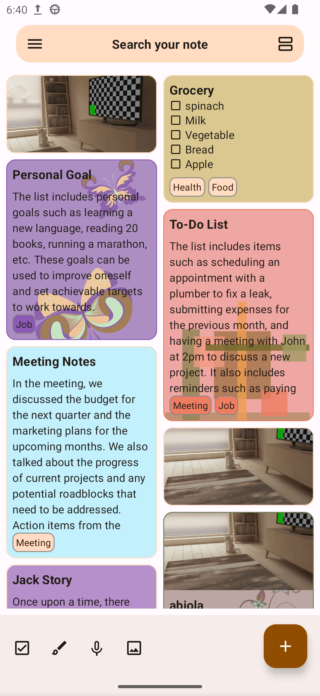
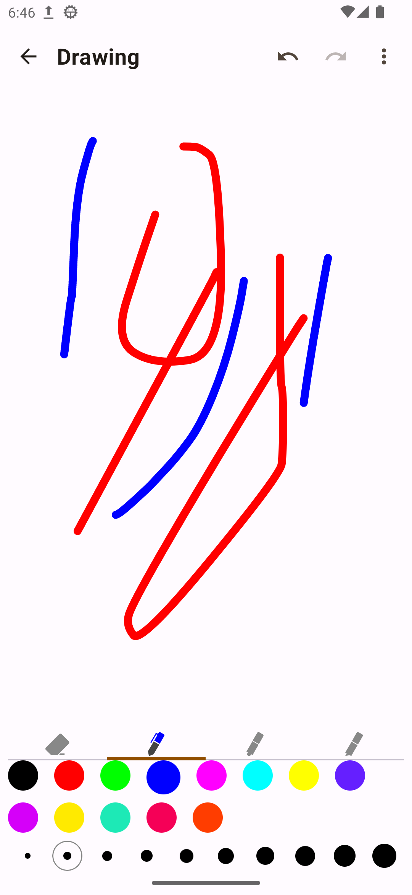
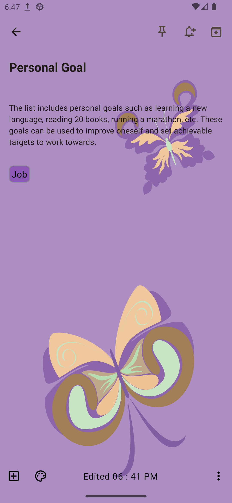
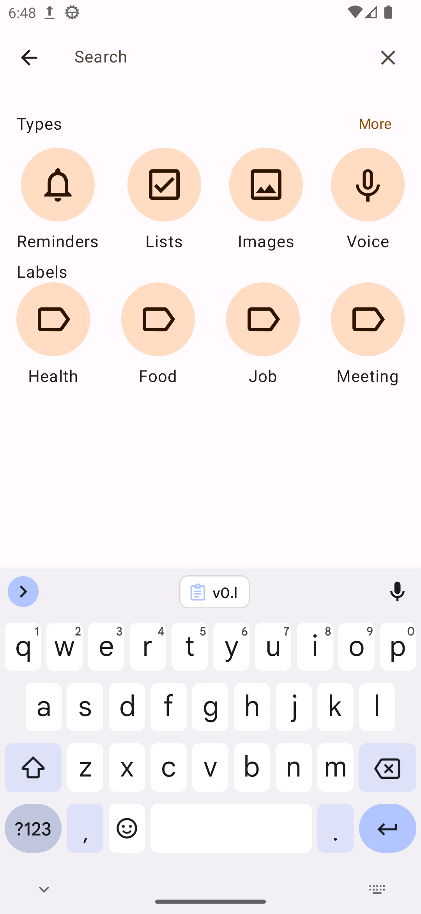
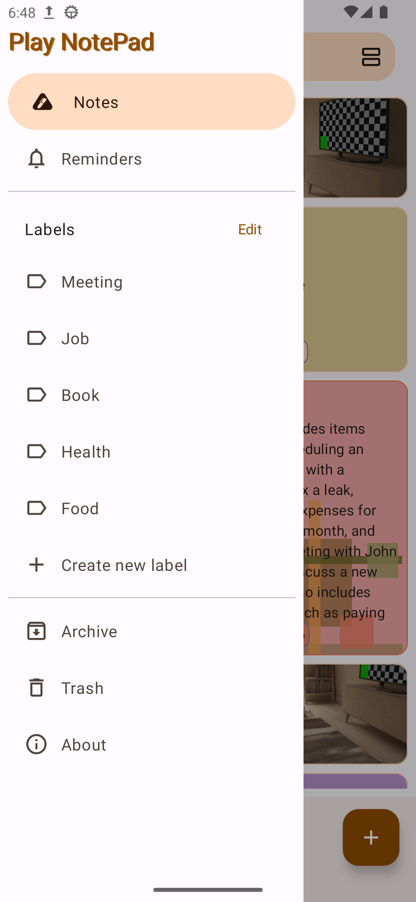

# YourNotes

[](/images/ic_launcher-playstore.png)

YourNotes is a powerful and elegant note-taking application designed for Android. Capture your thoughts, ideas, tasks, and inspiration with ease. Featuring a beautiful Material 3 design, rich text editing, reminders, labels, and much more — YourNotes helps you stay organized and productive wherever you go.

## Features

- **Rich Note Creation** — Create and edit text notes with a clean, intuitive editor.
- **Checklists** — Build task lists with interactive checkboxes to track your to-dos.
- **Reminders** — Set reminders for important notes so you never miss a deadline or event.
- **Labels & Organization** — Tag your notes with labels and keep everything neatly sorted.
- **Pinned Notes** — Pin important notes to the top of your list for quick access.
- **Color Coding** — Assign colors to your notes for visual categorization.
- **Background Images** — Personalize your notes by adding background images.
- **Drawing & Sketching** — Draw freehand sketches and diagrams to annotate your notes.
- **Audio Notes** — Record audio notes and play them back anytime.
- **Photo Attachments** — Snap a photo or pick one from your gallery to attach to a note.
- **Lazy Mode** — Auto-scrolling for hands-free reading of your notes.
- **Duplicate & Share** — Duplicate notes for easy reference or share them via email and messaging.
- **Archive & Delete** — Archive completed tasks or delete notes you no longer need.
- **Search** — Find any note instantly by keyword, label, or type.
- **Multiple Views** — Switch between list and column layouts for comfortable reading.
- **Offline Access** — All your notes are available offline, anytime.
- **Edge-to-Edge UI** — Modern, immersive full-screen experience on Android 15+.

## Built With

- **Clean Architecture** with modular design
- **Jetpack Compose** for declarative UI
- **Material 3** Design System
- **Hilt** for dependency injection
- **Kotlin Coroutines & Flows** for reactive programming
- **Room** for local database storage
- **Gradle Version Catalog** for dependency management
- **Convention Plugins** for shared build logic

## Tech Stack

| Layer | Technology |
|-------|-----------|
| UI | Jetpack Compose, Material 3 |
| Navigation | Compose Navigation with Hilt |
| Architecture | MVVM + Clean Architecture |
| Dependency Injection | Hilt |
| Database | Room |
| Reactive Programming | Kotlin Flows & Coroutines |
| Build System | Gradle with Convention Plugins |
| Version Management | Gradle Version Catalog |
| Splash Screen | Android SplashScreen API |
| Edge-to-Edge | Android 15 EdgeToEdge API |

## Screenshots

[](images/screenshot1.png)
[](images/screenshot2.png)
[](images/screenshot3.png)
[](images/Screenshot4.png)
[](images/Screenshot5.png)

## Development

### Prerequisites

- **JDK 21** or later
- **Android Studio** (latest stable recommended)
- **Gradle** (bundled with Android Studio, or standalone)

### Building

```bash
# Clone the repository
git clone https://github.com/Bilal140202/YourNotes.git

# Navigate to the project directory
cd YourNotes

# Build the debug APK
./gradlew assembleDebug

# Build the release APK
./gradlew assembleRelease

# Build the release AAB (for Google Play)
./gradlew bundleRelease
```

### Project Structure

The project follows clean architecture with modularization:

```
YourNotes/
├── app/                          # Main application module
├── modules/
│   ├── common/                   # Shared utilities and extensions
│   ├── data/                     # Data layer (Room DB, repositories)
│   ├── ui/                       # UI utilities and components
│   └── designsystem/             # Design system (themes, typography)
├── feature/                      # Feature modules
│   ├── note/                     # Note creation, editing, listing
│   ├── notelistwithlabel/        # Notes filtered by label
│   ├── label/                    # Label management
│   ├── reminder/                 # Reminder management
│   └── settings/                 # App settings
├── core/
│   ├── common/                   # Core shared utilities
│   ├── database/                 # Room database setup
│   └── ui/                       # Core UI components
├── build-logic/                  # Gradle convention plugins
└── gradle/                       # Version catalog and wrapper
```

## Contribution

Contributions are welcome! If you'd like to contribute to YourNotes:

1. **Fork** the repository
2. Create your feature branch (`git checkout -b feature/AmazingFeature`)
3. **Commit** your changes (`git commit -m 'Add some AmazingFeature'`)
4. **Push** to the branch (`git push origin feature/AmazingFeature`)
5. Open a **Pull Request**

### Feedback

Found a bug or have a feature request? [Open an issue](https://github.com/Bilal140202/YourNotes/issues) on GitHub.

## License

YourNotes is licensed under the GNU General Public License v3.0 (GPL-3.0). See the [LICENSE](LICENSE) file for details.

## Author

**Bilal Ansari**

- Website: [ansaribilal.com](https://ansaribilal.com)
- GitHub: [Bilal140202](https://github.com/Bilal140202)
